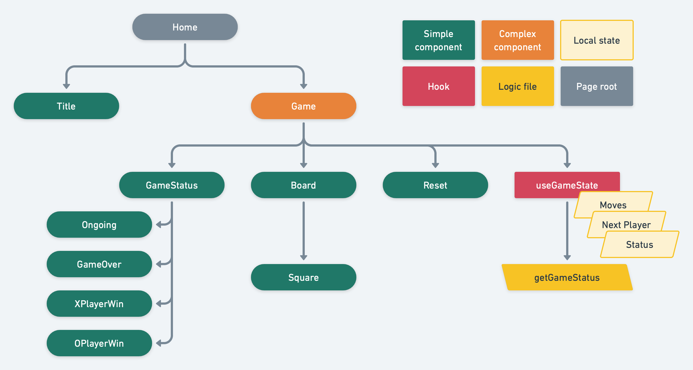

# tic-tac-toe

Toying again with this simple subject, using tailwind.

<!-- readme-package-icons start -->

&nbsp;&nbsp;&nbsp;&nbsp;&nbsp;&nbsp;&nbsp;&nbsp;&nbsp;&nbsp;

<!-- readme-package-icons end -->

## ⚡ Components tree

We segregate here simple from complex components. We can adopt distinct testing strategies depending on the complexity of a component: unit tests for simple components and integration tests for complex ones.

## ⚡ Complexity

So what makes a component complex? In the end, this is all about how hard it is to understand. A few factors that may influence this:

### 🔶 Local state

Is the component owning local state? This is the most common to distinguish components: stateless vs stateful. Historically, stateful components were called containers and were class components while stateless ones could be FCs. Of course React 16 changed all this but a lot of projects still use this containers vs components approach.

Do note this includes owning state through its hooks.

### 🔶 Server / Global state

Is the component using external state?

- By server state we mean cache that is reflecting interaction with our backend(s), managed by dedicated libraries. Take a look at [react-query](https://react-query.tanstack.com) or [swr](https://swr.vercel.app).
- About global state, in most projects this will mean "Is it connected to a redux store?". On modern approaches this could mean stuff like "Is it using jotai atoms?". Redux is still widely used but I would not advise using it unless you **really** don't have another choice. More details [here](https://github.com/jpb06/workshop-react-front/blob/master/docs/bp-frontend-guidelines.md#-lets-avoid-redux-if-we-can).

### 🔶 Rendering complexity

- Is there a convoluted rendering workflow? Conditional rendering?
- Is there side effects?
- Is the component containing complex logic?

### 🔶 Testability

Simply put, how easy is the component to test?

## ⚡ Guidelines

### 🔶 Use FCs and hooks

No brainer here. Class components are done for!

### 🔶 KISS : Keep It Simple, Stupid

Between two solution, the simplest one will always be better. Complexity means higher maintainability costs. Please. Do not overengineer stuffs 🥲.

A source of complexity often comes from the tools we choose to answer a problem. For example, using redux middlewares like thunk/saga to deal with server state. There is better choices like swr or react-query for this!

### 🔶 DRY : Don't Repeat Yourself

We hear that one every day as developers. Generally a good advice; use it rationally though. Functionnally divergent code is not a good candidate for factorization.

### 🔶 YAGNI : You Ain't Gonna Need It

Again. Do not overengineer stuffs 🥲. Add only to the codebase what is strictly necessary to answer your need. The more code you add, the more code you will have to maintain.

### 🔶 SSOT : Single Source Of Truth

Parts of the codebase can benefit from being centralized. Relates to DRY.

### 🔶 Do one thing, do it well (Single Responsibility Principle)

Components / hooks / modules should have as few responsibilities as possible. Less responsibilities means less complexity and easier testing. Easier understanding for our next readers as well.

### 🔶 Make it fit to the screen

By limiting the number of lines each unit of code can have, we mechanically enforce SRP. We make sure each unit is easy to understand.

### 🔶 Maximize signal to noise ratio / convey intent

Our goal is to maximize signal to noise radio to help our future readers understand and maintain easily our codebase. Every single line of code should be necessary and be clear about what it does. The original intent of the author should be clear.

### 🔶 Naming is key

Spliting the code into small units means we get great opportunities to convey intent to our future readers, by naming units of code with labels informing us about their purpose : what they do / are.

### 🔶 Limit indentation

Two levels of indentation max (That's an if statement inside another if for example). One level max in react components.

Indentation means higher cyclomatic complexity, which means higher complexity. We want to keep things simple.

A few tricks can help us here:

- Extract code. Limiting indentation gives us an opportunity to label things by extracting them.
- Return early: if execution path can no longer continue (conditions unmet), simply return right away.
- Fail fast and loud: if an error occurs, terminate immediately.

### 🔶 The rule of seven / Functions: O2

When we read code, our brain is the compiler. We have limited capabilities. For example, we cannot juggle with seven values at the same time (try it yourself). That is why we should limit the number of floating variables in a hook or a module. Functions parameters should be limited as well: one or two is ideal. It will limit the risk to give too many responsibilities to an unit of code.

### 🔶 Avoid complex conditionals

More than two combined conditions in a if makes it very hard to evaluate the end result. If you have to combine conditions, extract them in variables. It will also help you conveying intent.

### 🔶 Avoid magic numbers

Adding a literal value does not inform the reader about the intent behind this decision. Creating a named constant gives you, again, an opportunity to convey intent.
